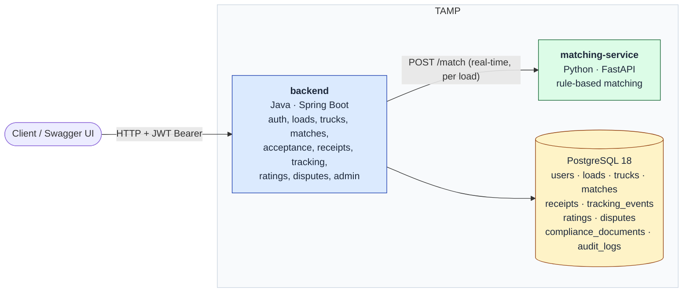

# Service Boundary

High-level view of the two services, the database, and the boundary between them, as
actually delivered by the end of the project (issues #1–#18).

## Why two services

Matching is the component most likely to be replaced — rule-based today, potentially
model-based later. Keeping it behind a network boundary means that replacement never
touches the API surface, authentication, or persistence.

The cost of that choice is a real network hop between two languages. It was proven early
(#13) before any feature depended on it, and its timing is covered by
`MatchingTimingE2ETest` (real HTTP call under 2 seconds against seeded data).

## Current state

| Service | Path | Responds on | Status |
|---|---|---|---|
| backend | [`backend/`](../../backend/) | `http://localhost:8080/` | Full API surface: auth, users, loads, trucks, matching, acceptance/receipts, tracking, ratings, disputes, admin |
| matching-service | [`matching-service/`](../../matching-service/) | `http://localhost:8000/` | Real rule-based matching (capacity, cargo/vehicle compatibility, availability, location) |
| db | Postgres 18, dockerized (#7) | internal only | 10 tables, all migrations applied, seeded with a full demo journey (`db/seed/dev-seed.sql`) |

Both services call each other for real (`backend` → `matching-service` over HTTP), and
`backend` is backed by a real database rather than in-memory state.

## Known gap: authentication is issued but not enforced

`backend` issues real JWTs on login (#9) and every request can present one via
`Authorization: Bearer <token>`, but no business endpoint currently requires or checks
that token — role/actor identity is still taken from caller-supplied ids (`ownerId`,
`raterId`, `adminId`, etc.) rather than the authenticated principal. See
[`known-limitations.md`](../known-limitations.md).
