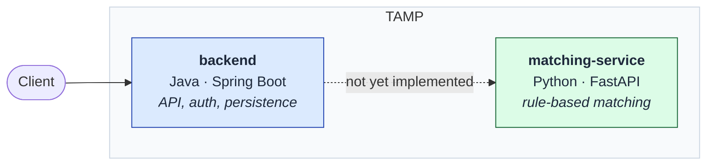

# Service Boundary

High-level view of the two services and the boundary between them.

> **Stub.** Reflects the scaffolding as built: two services that start independently. The call between them is not implemented yet. This diagram is replaced with the real architecture once the full system exists.

## Why two services

Matching is the component most likely to be replaced — rule-based today, potentially model-based later. Keeping it behind a network boundary means that replacement never touches the API surface, authentication, or persistence.

The cost of that choice is a real network hop between two languages, which is the project's highest technical risk. It is proven early and deliberately, before any feature depends on it.

## Current state

| Service | Path | Responds on | Status |
|---|---|---|---|
| backend | [`backend/`](../../backend/) | `http://localhost:8080/` | Starts, serves a liveness response |
| matching-service | [`matching-service/`](../../matching-service/) | `http://localhost:8000/` | Starts, serves a liveness response |

Neither service calls the other yet, and neither has a database.
